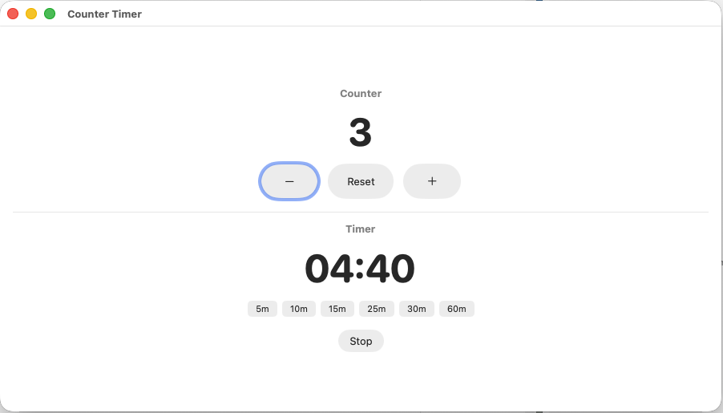

# Counter Timer

A minimal macOS app with a counter and a timer. Built with SwiftUI in a single file.


<p align="center">
  
</p>

## Features

**Counter**
- Increment / decrement with `+` and `-` buttons (or keyboard keys)
- Reset to zero

**Timer**
- Click the time display to type a custom duration (`MM:SS` or just minutes)
- Preset shortcuts: 5, 10, 15, 25, 30, 60 minutes
- Start / Stop with spacebar
- Audible beep when the timer finishes

## Install

Requires macOS 14+ and Xcode Command Line Tools (`xcode-select --install`).

```bash
git clone https://github.com/skcadri/counter-timer-app.git
cd counter-timer-app
make install
```

This compiles the app, bundles it with an icon, and copies it to `/Applications`.

To build without installing:

```bash
make        # creates "Counter Timer.app" in the project directory
```

## License

MIT
